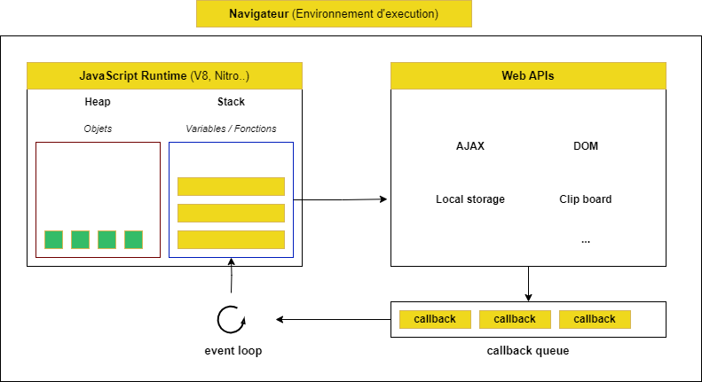
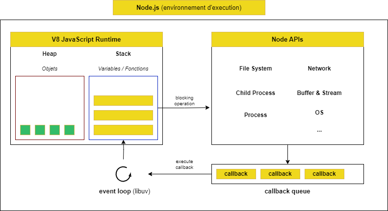

# What is nodejs?

- Moteur javacript (javascript engine)

  - Interprete et execute le javascript
  - Chaque navigateur a son propre moteur JS, mais tous suivant la spécifiction ECMAScript sur comment le language javascript doit fonctionner
    - Chrome, Node (V8), Firefox (SpiderMonkey), Safari (Nitro)
  - Node.js utilise V8

- Environnement d'execution Javascript

  - Inclus le moteur et d'autres fonctionnalités au de-delà du language
  - Dans un navigateur (`DOM`, `Events`, `XMLHttpRequest`, `fetch`, `localStorage`, `sessionStorage`)
  - Dans Node `fs`, `http`, `net`, `events`, `path`, `url`, `crypto`, `fs`, `child_process`





```bash
node -c ./code/1/bad-syntax.js

node -c ./code/1/correct-syntax.js

node ./code/1/correct-syntax.js

# chrome://inspect
node --inspect-brk ./code/1/correct-syntax.js

node -e "console.log(1 + 1)"

node -p "1 + 1"
```
